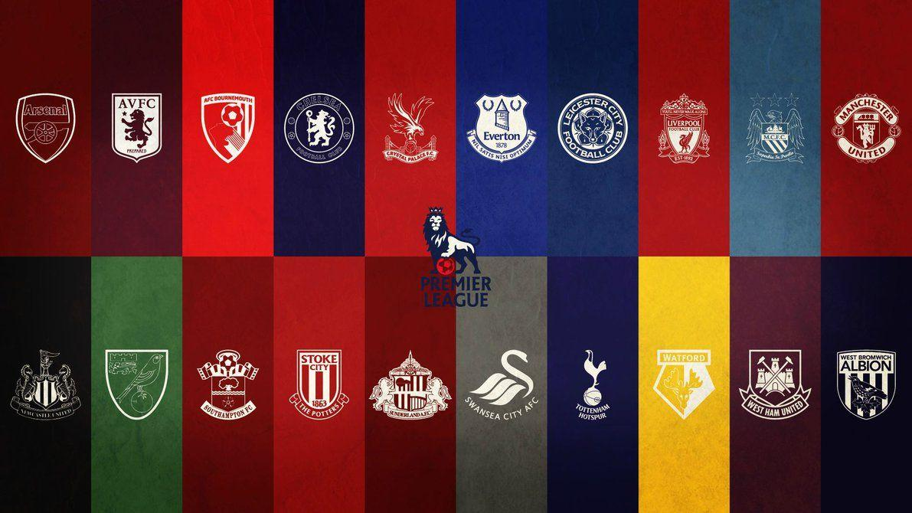
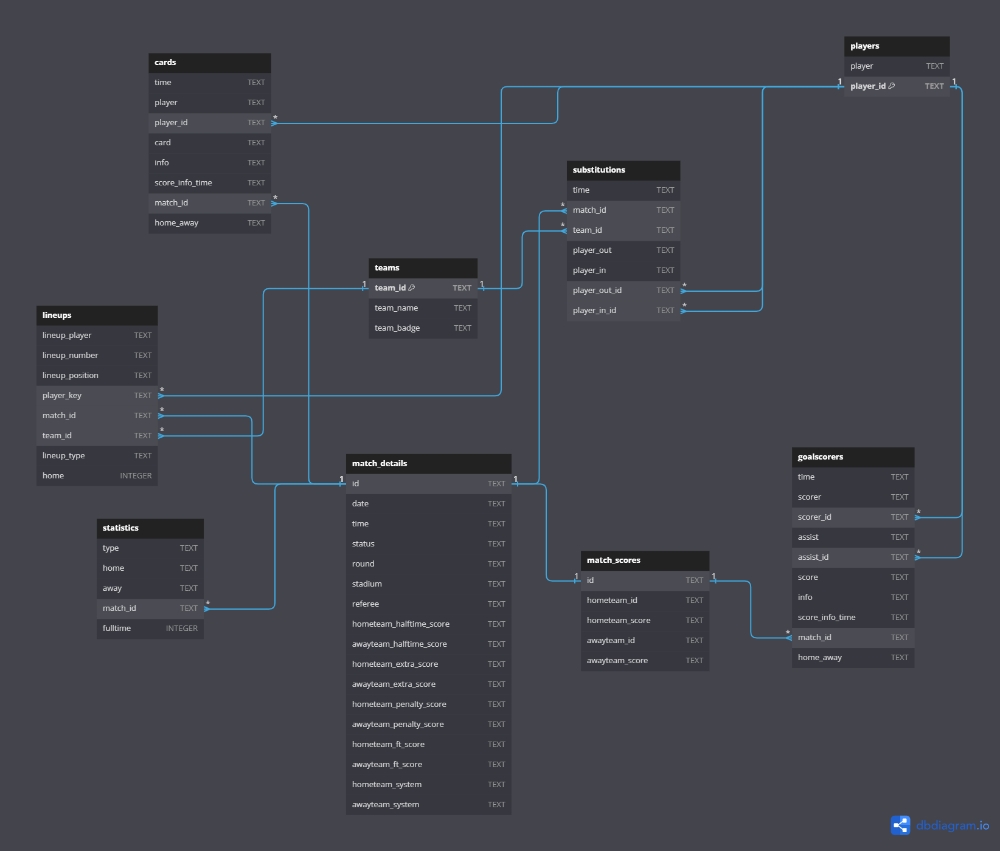

# Premier League Data Engineering



Welcome to the Premier League Data Engineering project, where we tackle the challenge of consuming data from the [FootballAPI](https://apifootball.com/documentation), processing it, pushing it to a PostgreSQL database, normalizing the data, and running analytics. This entire process is orchestrated within containers using Python, Docker, and docker-compose.

## Table of Contents
- [Premier League Data Engineering](#premier-league-data-engineering)
  - [Table of Contents](#table-of-contents)
  - [Getting Started](#getting-started)
    - [Prerequisites](#prerequisites)
    - [Reproducing the App](#reproducing-the-app)
    - [.env Example](#env-example)
  - [Normalization Choices](#normalization-choices)
  - [Normalization Choices](#normalization-choices-1)
  - [Challenge Guidelines](#challenge-guidelines)
    - [1. API Access and Key Retrieval](#1-api-access-and-key-retrieval)
    - [2. Database Design](#2-database-design)
    - [3. SQL Queries](#3-sql-queries)
    - [4. Data Export](#4-data-export)
    - [5. Docker Container and App Deployment](#5-docker-container-and-app-deployment)
    - [6. ReadME File](#6-readme-file)
    - [7. GitHub Repository](#7-github-repository)
  - [Contact](#contact)

## Getting Started

### Prerequisites
Before you begin, ensure you have the following prerequisites:
- [Git](https://git-scm.com/)
- [Docker](https://docs.docker.com/get-docker/)
- [Docker Compose](https://docs.docker.com/compose/install/)

### Reproducing the App
To reproduce this project, follow these steps:

1. **Clone the Repository**:
   ```bash
   git clone https://github.com/lucca-miorelli/premier-league-data-engineering.git
   cd premier-league-data-engineering
   ```

2. **Install Docker and Docker Compose**: If you haven't already, install Docker and Docker Compose using the official installation guides:
   - [Docker Installation](https://docs.docker.com/get-docker/)
   - [Docker Compose Installation](https://docs.docker.com/compose/install/)

3. **Run the Application**:
   In the project root directory, run the following command to build and start the containers:
   ```bash
   docker-compose up --build
   ```

4. **Stop the Application**:
   To stop the containers and remove them, use the following command:
   ```bash
   docker-compose down -v
   ```

The desired outcome is that the Python container runs `app.py` and performs ETL on Premier League data, pushing it to a PostgreSQL database in the other container. By the end, it runs 4 .sql files from the `sql/` folder and stores the results in .csv files in a local folder mounted to the container named `data/`.

### .env Example
Here's an example of the `.env` file you should create to reproduce the environment variables needed:

```plaintext
# .env 

# Database configuration
POSTGRES_DB=YOU-DB-NAME
POSTGRES_USER=YOUR-USERNAME
POSTGRES_PASSWORD=YOUR-PASSWORD

# API Keys
API_KEY=YOUR-API-KEY
```
This will be used to set the environment variables in the `docker-compose.yml` file.

## Normalization Choices
## Normalization Choices

I have made specific normalization choices for the database design based on the structure and relationships of our data. However, it's essential to acknowledge that due to time limitations, I had to prioritize the completion of the full assignment over achieving ideal data quality and data integrity.

I recognize that data integrity and quality are paramount in any data engineering project, and they must always be at the forefront of my considerations. In this particular case, achieving a highly normalized database structure would have been time-consuming and might have delayed the deployment of the full application.

As a consequence of this trade-off, some of my SQL queries might not be as performant as I would have liked. Nevertheless, I maintained a balance between meeting the assignment requirements and the need to deploy the complete application on time. I understand that there is room for improvement in optimizing the database schema and queries for better performance while ensuring data integrity and quality.




We have tables for teams, goalscorers, cards, substitutions, lineups, players, statistics, match details, and match scores. Each table serves a specific purpose, and primary and foreign keys are used to establish relationships where necessary.


## Challenge Guidelines

### 1. API Access and Key Retrieval
- [x] Registered an account on the apifootball site.
- [x] Secured the API key.
- [x] Utilized League ID 152 (Premier League).
- [x] Made two separate requests utilizing specified date ranges due to API limits.

### 2. Database Design
- [x] Created a compact dimensional model for events data, comprising dimensions and facts.

### 3. SQL Queries
- [x] Final League Table query: Outputs position, team_name, matches_played, won, draw, lost, goals_scored, goals_conceded, and points with proper points allocation and tiebreakers.
- [x] Display all teams sorted by Away goals scored.
- [x] Top 5 Referees with Most Cards query.
- [x] Top 3 Goal Scorers by Match Round 14 query.

### 4. Data Export
- [x] Exported query results to CSV files: query_a.csv, query_b.csv, query_c.csv, and query_d.csv.

### 5. Docker Container and App Deployment
- [x] Developed a Docker container to host the application.

### 6. ReadME File
- [x] Created a comprehensive README file detailing assumptions, choices, and instructions to execute the application.

### 7. GitHub Repository
- [x] Uploaded the project to a GitHub repository.


## Contact
Thanks for exploring the Premier League Data Engineering project! If you have any questions or suggestions, feel free to reach out on [GitHub](https://github.com/lucca-miorelli) or [LinkedIn](https://www.linkedin.com/in/lucca-miorelli/).

Enjoy exploring the world of soccer analytics!
```
